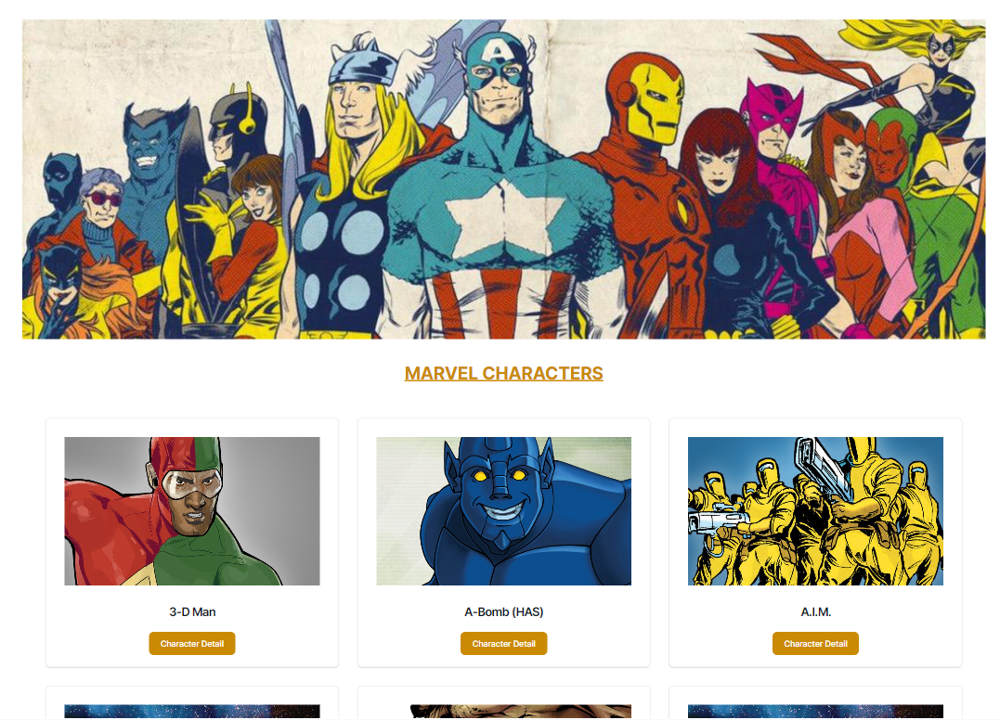
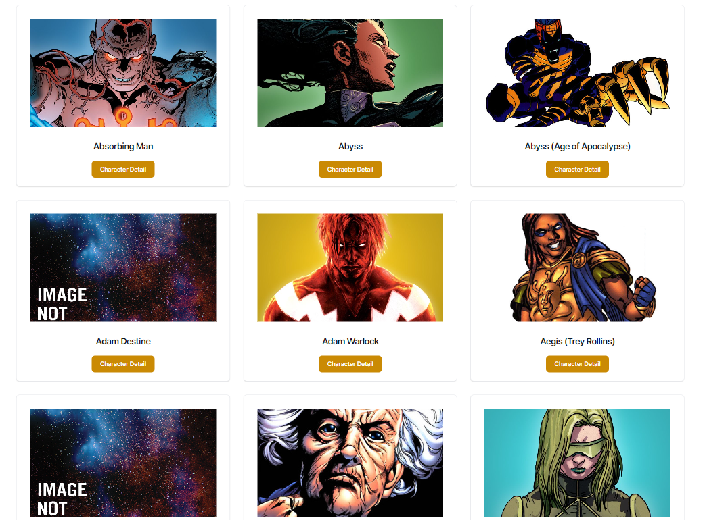
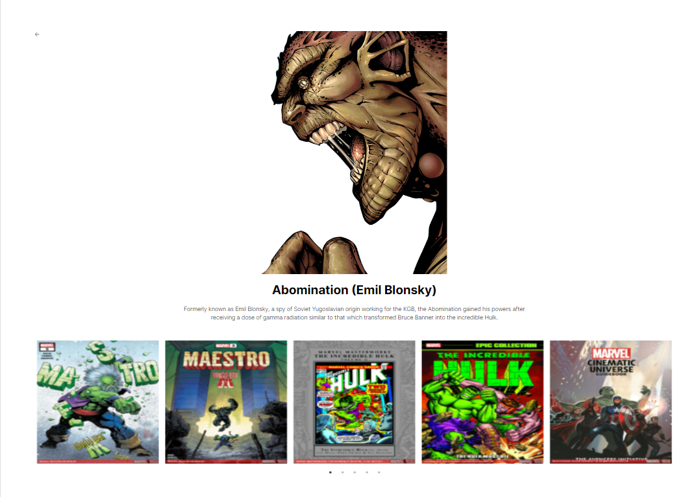

# Marvel


A NextJS Application using Marvel API to display data about characters. Live demo available at:  [Marvel App](marvel-5s8dg478y-dilancirkin.vercel.app)


## Description
Marvel characters are listed on the first page. You can enter the detail page of the characters and get more information about them.

## Images







## Getting Started
1.To get this project files locally on your machine, you can clone this repository by running the following command on your terminal or command line:
```bash
git clone https://github.com/dilancirkin/nextjs-marvel
```
2.Next,get required API Keys and credentials from the following service providers
[Marvel API Gateway](https://developer.marvel.com/)

3.Install all the dependency packages found in the package.json file by running yarn install or npm install from the project root directory.

4.To start the development server of the application:

```bash
npm run dev
# or
yarn dev
# or
pnpm dev
# or
bun dev
```

Open [http://localhost:3000](http://localhost:3000) with your browser to see the result.

You can start editing the page by modifying `app/page.tsx`. The page auto-updates as you edit the file.

This project uses [`next/font`](https://nextjs.org/docs/basic-features/font-optimization) to automatically optimize and load Inter, a custom Google Font.


## Technologies


[React JS](https://react.dev/)

[NextJS](https://nextjs.org/)

[Tailwind CSS](https://tailwindcss.com/)

[TypeScript](https://www.typescriptlang.org/)

[JEST](https://jestjs.io/)

[React Icons](https://react-icons.github.io/react-icons/)

[MD5](https://www.npmjs.com/package/md5)

